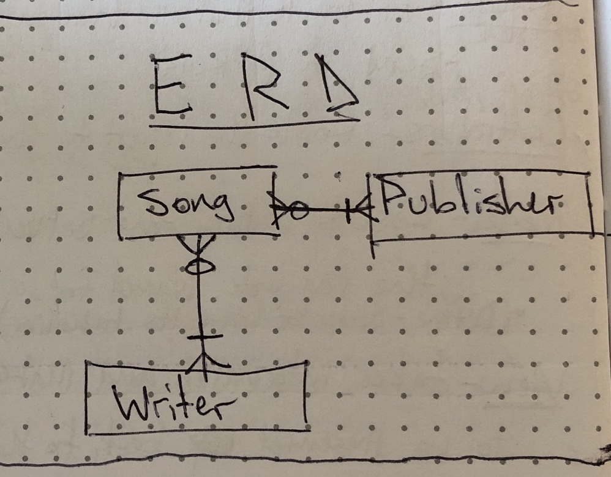
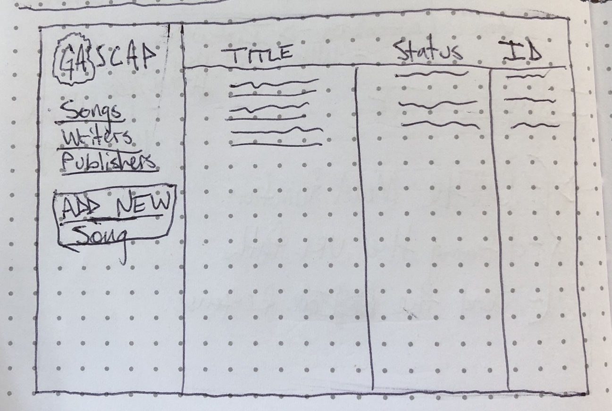
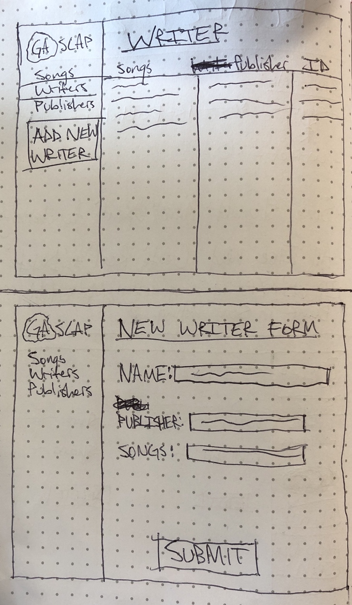

# Austin Blaine - SEI22 Project 2
### GASCAP - PRO

* [Project Board](https://trello.com/b/EnejcSe9/sei22-project-2)

* [Deployed App](https://shrouded-stream-94500.herokuapp.com/)

## Phase 2 Plans:
* Add ability to add more than one writer or publisher to a song and split the writer/publisher share
* When in "New Song" form, adding a new writer or publisher isn't a smooth process, you essentially have to start over with the new song form so I'd like to streamline that some more.

## ERD:

## Wireframes:

